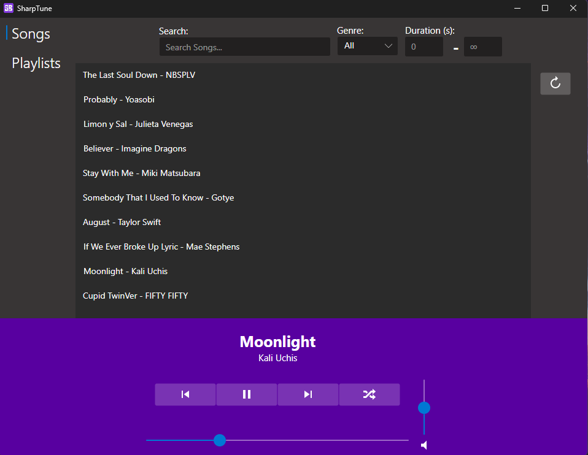

  

<h1 align="center">
    SharpBeat
</h1>

Welcome to SharpBeat repository! This project aims to provide a frontend
application for a music streaming application using the F# programming
language and Avalonia framework. It allows you to manage songs and playlists.

This application is hardcoded to work with [zSnails/plyr](https://github.com/zSnails/plyr)
music server. As part of a project for my Programming Languages course at Costa Rica 
Institute of Technology.

## Contributing

Contributions are welcome! Feel free to open issues for bug reports, feature
requests, or any questions you might have. Pull requests are also accepted.

## License

This project is licensed under the MIT License. See the [LICENSE](LICENSE) file
for details.

# TODO:

- [ ] Fix current is changed when shuffle or refresh
- [ ] Fix filters to work simultaneously
